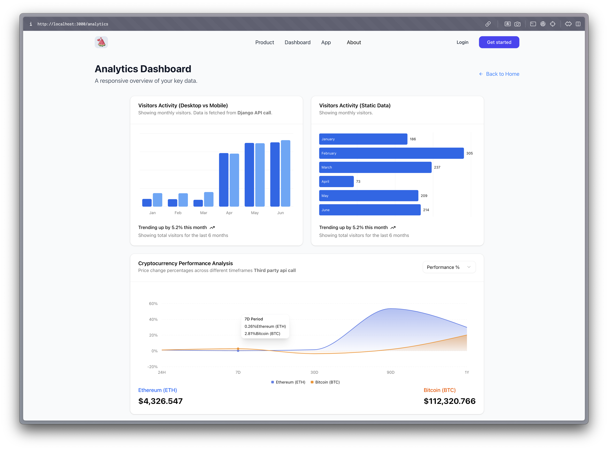

# Social Booster Media App



- This is a simple crud application built with **NextJS**, **Python(django)** & **PostgreSQL**. This app is my submission to social booster media's take-home assessment.
- In this readme file first you'll find application setup instructions, then I have given information about the backend (APIs) that I have built and used i.e. third party apis.

# App set up

First clone this repository in your system.

```bash
git clone git@github.com:Now-Tiger/socialboostermedia.git
```

Change directory.

```bash
cd socialboostermedia
```

Run application locally.

```bash
npm install
npm run dev
```

Visit `http://localhost:3000` on your browser.

# Frontend App structure

- On startup you have a Navbar with few options, and a card that displays two buttons.
- `Fetch data` button and `Dashboard` navbar item redirects you the `../analytics` page.
- `Add data` button and `App` navbar item redirects you to the `../app` page.

#### Analytics page

- Analytics page displays three cards/charts.
- First card, displaying vertical bar chart, displays the data returned by backend(hosted on AWS EC2) API call i.e. `https://nowtiger.dpdns.org/user-analytics/`
  - This API supports `GET` & `POST` HTTP methods.
  - You can make `POST` API call to this API, please navigate to **App** page using navbar option.
  - Successfully added data can be seen on first chart (Add data for the month of January, 2024)
- Second card, displaying horizontal bar chart, shows static data (No API call)
- Third & last card, displays area chart, shows data from **Third-party** [crypto market data API](https://developers.coindesk.com/documentation/data-api/index_cc_v1_latest_tick)

#### App page

- On app page, you have a form. After adding the data you can see that data on the first bar chart displayed on the Analytics page.
- The form data is sent to `https://nowtiger.dpdns.org/user-analytics` API using `POST` method, on successful API call the API returns the data that is being sent via API and that data can be displayed on Analytics page.
- To see this in action, add larger quantities/numbers for desktop or mobile fields for the month of January 2024.
